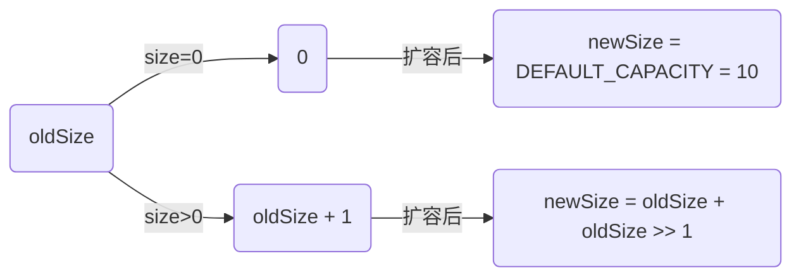

## 数学知识准备

1.  指数
    $$
    X^AX^B = X^{A+B}
    $$
    
    $$
    \frac {X^A}{X^B} = X^{A-B}
    $$
    
    $$
    (X^A)^B = X^{AB}
    $$
    
    $$
    X^N + X^N = 2X^N
    $$
    
    $$
    2^N + 2^N = 2*2^N = 2^{N+1}
    $$
    
2.  对数

    对数与指数的关系：
    $$
    X^A = B  \Leftrightarrow \log_X B = A
    $$

    $$
    \log_A B = \frac {\log_C B}{\log_C A} (C > 0)
    $$

    $$
    \log_{AB} = \log_A + \log_B \\
    \log_{\frac {A}{B}} = \log_A - \log_B \\
    \log_{A^B} = B\log_A \\
    \log_X < X (X > 0) \\
    计算机中无特殊说明，默认以2为底
    $$

3.  级数
    $$
    \sum_{i=0}^N2^i = 2^{N+1} - 1 \\
    \sum_{i=0}^NA^i = \frac {A^{N+1} - 1}{A - 1} \\
    \sum_{i=0}^NA^i \leq \frac {1}{1-A} (0 < A < 1)
    $$

    $$
    \sum_{i=1}^Ni^2 = \frac {N(N+1)(2N+1)}{6} \approx \frac {N^3}{3} \\
    \sum_{i=1}^Ni^k \approx \frac {N^{k+1}}{k+1} (k \neq -1)
    $$

    当k = -1时，称之为调和数，其和称之为调和和:
    $$
    H_N = \sum_{i=1}^N\frac {1}{i} \approx \log_e^N
    $$

4.  模运算

    如果N能够整除A-B，那么A与B模N同余，记做：
    $$
    A \equiv B \pmod {N}
    $$
    同理有：
    $$
    A + C \equiv B + C \pmod{N} \\
    AD \equiv BD \pmod{N}
    $$
    

## 算法分析

1.  常见算法：

    二分查找、欧几里得算法

2.  

    

3.  算法练习: 最大子序和

    https://leetcode-cn.com/problems/maximum-subarray/

4.  

## 链表

###### ArrayList 

底层数组实现：

数组扩容：

